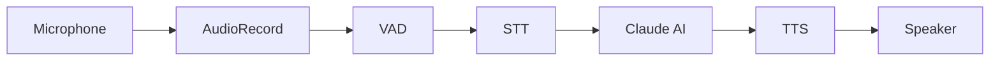

# [Android Voice AI SDK in Model-View-ViewModel (ie MVVM)](https://github.com/ahmedeltaher//Android-MVVM-Architecture-Android-Voice-AI-SDK/)


[](https://kotlinlang.org/)
[](https://kotlinlang.org/docs/coroutines-overview.html)
[](https://developer.android.com/jetpack/compose)
[](https://dagger.dev/hilt/)
[](https://mockk.io/)
[](https://junit.org/junit5/)
[](https://developer.android.com/training/testing/espresso/)
[](https://github.com/googlesamples/android-architecture)
[](https://developer.android.com/reference/android/speech/SpeechRecognizer)
[](https://platform.openai.com/docs/guides/speech-to-text)
[](https://developer.android.com/reference/android/speech/tts/TextToSpeech)
[](https://elevenlabs.io/docs)
[](https://docs.anthropic.com/)
  




---
The Android Voice AI SDK is a reusable Android library that gives any app a full voice-driven AI conversation pipeline in minutes. It captures audio from the device microphone, transcribes speech to text, sends the transcript to Anthropic Claude for an intelligent response, and speaks the reply back to the user through text-to-speech — all wired together with a single `VoiceAISDK.Builder` call. The SDK ships ready-to-drop-in Jetpack Compose UI components, swappable STT/TTS engine adapters, on-device emotion detection, and security utilities including PII redaction and encrypted key storage.


## Features

| Layer | Capability |
|-------|-----------|
| **Audio Input** | Voice Activity Detection (VAD), noise handling, streaming PCM capture |
| **Recognition** | Speech-to-Text (STT), language detection, speaker diarization |
| **Understanding** | Intent extraction, entity recognition, conversation context |
| **Action** | API orchestration, workflow execution, task automation |
| **Response** | LLM answer generation (Anthropic Claude) |
| **Voice Output** | Text-to-Speech (TTS), voice style selection, audio streaming |
| **Safety** | User consent, authentication, abuse prevention |
| **Analytics** | Conversation logs, session summaries, quality metrics |


## Requirements

| Requirement | Version |
|---|---|
| Android Studio | Meerkat or newer |
| Minimum SDK | 24 (Android 7.0) |
| Kotlin | 2.0+ (project uses 2.3.21) |
| Anthropic API key | Required — obtain at [console.anthropic.com](https://console.anthropic.com) |

## Quick Start

### Step 1 — Add the dependency and manifest permissions

In your app `build.gradle.kts`:

```kotlin
dependencies {
    implementation("com.sdk:voice-ai-sdk:1.0.0")
}
```

In `app/src/main/AndroidManifest.xml`:

```xml
<uses-permission android:name="android.permission.RECORD_AUDIO" />
<uses-permission android:name="android.permission.INTERNET" />
<uses-permission android:name="android.permission.ACCESS_NETWORK_STATE" />
```

### Step 2 — Hilt setup

Annotate your `Application` class with `@HiltAndroidApp` and your `Activity` with `@AndroidEntryPoint`:

```kotlin
@HiltAndroidApp
class MyApp : Application()

@AndroidEntryPoint
class MainActivity : ComponentActivity() { ... }
```

### Step 3 — Add your API key to local.properties

`local.properties` is git-ignored, so your key never ends up in source control:

```properties
ANTHROPIC_API_KEY=sk-ant-...
```

Then expose it via `BuildConfig` in `app/build.gradle.kts`:

```kotlin
defaultConfig {
    buildConfigField(
        "String",
        "ANTHROPIC_API_KEY",
        "\"${project.findProperty("ANTHROPIC_API_KEY") ?: ""}\"",
    )
}

buildFeatures {
    buildConfig = true
}
```

### Step 4 — Build the SDK

Provide the SDK through Hilt by creating an `AppModule`:

```kotlin
@Module
@InstallIn(SingletonComponent::class)
object AppModule {

    @Provides
    @Singleton
    fun provideVoiceAIConfig(): VoiceAIConfig =
        VoiceAIConfig(anthropicApiKey = BuildConfig.ANTHROPIC_API_KEY)

    @Provides
    @Singleton
    fun provideVoiceAISDK(
        @ApplicationContext context: Context,
        config: VoiceAIConfig,
    ): VoiceAISDK = VoiceAISDK.Builder(context)
        .anthropicApiKey(config.anthropicApiKey)
        .debugLogging(BuildConfig.DEBUG)
        .build()
}
```

Or construct the SDK directly without Hilt:

```kotlin
val sdk = VoiceAISDK.Builder(context)
    .anthropicApiKey(BuildConfig.ANTHROPIC_API_KEY)
    .debugLogging(true)
    .config { copy(systemPrompt = "You are a concise voice assistant.") }
    .build()

val session: VoiceAISession = sdk.createSession()
session.start()
```

### Step 5 — Add the VoiceScreen composable

Use `VoiceSessionPermissionGate` to handle the `RECORD_AUDIO` runtime permission automatically, then place `VoiceButton` and `ConversationView` inside:

```kotlin
@Composable
fun VoiceScreen(viewModel: VoiceViewModel = hiltViewModel()) {
    VoiceSessionPermissionGate(
        rationale = "Microphone access is required for voice conversations.",
    ) {
        Column(
            modifier = Modifier
                .fillMaxSize()
                .padding(16.dp),
            verticalArrangement = Arrangement.SpaceBetween,
        ) {
            ConversationView(
                messages = viewModel.messages.collectAsStateWithLifecycle().value,
                modifier = Modifier.weight(1f),
            )
            VoiceButton(
                session = viewModel.session,
                modifier = Modifier.align(Alignment.CenterHorizontally),
            )
        }
    }
}
```

## Architecture

The SDK is organised into six layers, each with a single responsibility:

| Layer | Package | Responsibility |
|---|---|---|
| **Audio** | `audio/` | Raw PCM capture via `AudioRecord`, voice activity detection (VAD), audio level metering, and PCM-to-WAV conversion |
| **STT** | `stt/` | `SpeechToTextEngine` interface with a drop-in Android built-in implementation; plug in Whisper or any other engine |
| **AI** | `ai/` | `AIEngine` interface backed by `ClaudeAIEngine`, which wraps the official Anthropic Java SDK and maintains conversation history |
| **TTS** | `tts/` | `TextToSpeechEngine` interface with a drop-in Android built-in implementation; plug in ElevenLabs for premium voices |
| **Session** | `VoiceAISession` | Orchestrates the full pipeline — audio in, transcript out, AI reply, speech out — as a single coroutine-based lifecycle |
| **UI** | `ui/` | Ready-to-use Jetpack Compose components: `VoiceButton`, `ConversationView`, `VoiceSessionPermissionGate`, `WaveformVisualizer`, `LiveCaptionBanner`, `VoiceStatusIndicator` |

## Available Engines

| Category | Engine | Class | Notes |
|---|---|---|---|
| STT | Android built-in | `AndroidSttEngine` | Default; free; uses `android.speech.SpeechRecognizer`; requires network |
| STT | OpenAI Whisper | `WhisperSttEngine` | Higher accuracy; POSTs PCM/WAV to OpenAI REST API; requires OpenAI key |
| AI | Anthropic Claude | `ClaudeAIEngine` | Default and only AI engine; uses `com.anthropic:anthropic-java`; model is configurable |
| TTS | Android built-in | `AndroidTtsEngine` | Default; free; uses `android.speech.tts.TextToSpeech` |
| TTS | ElevenLabs | `ElevenLabsTtsEngine` | High-quality natural voices; POSTs to ElevenLabs REST API; requires ElevenLabs key |
| Emotion | On-device | built-in | Lightweight on-device audio feature analysis; no external key required |
| Emotion | Hume AI | `HumeEmotionDetector` | Cloud-based; high accuracy across 7 emotions; requires Hume API key |

## Configuration Reference

All options are fields on `VoiceAIConfig`. Pass a `config { }` block to `VoiceAISDK.Builder` to override defaults.

| Field | Type | Default | Description |
|---|---|---|---|
| `anthropicApiKey` | `String` | — | Required. Your Anthropic API key. Never hardcode; read from `BuildConfig` or encrypted storage. |
| `aiModel` | `String` | `"claude-3-5-sonnet-20241022"` | Claude model ID used for all AI turns. |
| `systemPrompt` | `String?` | `"You are a helpful voice assistant…"` | System instruction prepended to every conversation. |
| `inputMode` | `InputMode` | `HANDS_FREE` | `HANDS_FREE` activates VAD; `PUSH_TO_TALK` records only while button is held. |
| `locale` | `Locale` | `Locale.getDefault()` | Locale passed to the STT engine for language hints. |
| `silenceTimeoutMs` | `Long` | `1200` | Milliseconds of silence after speech before the STT turn is finalised. |
| `maxHistoryTurns` | `Int` | `20` | Maximum number of conversation turns kept in the Claude context window. |
| `piiRedaction` | `Boolean` | `false` | When `true`, strips phone numbers, emails, and credit-card numbers from transcripts before sending to the AI. |
| `emotionDetectionEnabled` | `Boolean` | `false` | Enables voice emotion detection. Requires user consent; set `emotionConsentRationale`. |
| `certificatePins` | `List<String>` | `emptyList()` | SHA-256 certificate pins applied to the OkHttp client for network requests. |

## Voice Emotion Detection

When enabled, the SDK analyses the acoustic features of each recorded utterance and annotates AI turns with the detected emotion (`NEUTRAL`, `HAPPY`, `SAD`, `ANGRY`, `FEARFUL`, `SURPRISED`, or `DISGUSTED`). Set `emotionAwareAI = true` to have the detected emotion automatically injected into the Claude system context so the AI can adapt its tone. Always present a clear consent rationale before enabling this feature.

```kotlin
val sdk = VoiceAISDK.Builder(context)
    .anthropicApiKey(BuildConfig.ANTHROPIC_API_KEY)
    .config {
        copy(
            emotionDetectionEnabled = true,
            emotionConsentRationale = "Emotion analysis helps the assistant respond more empathetically.",
            emotionAwareAI = true,
        )
    }
    .build()
```

## Security

- **API keys are never hardcoded.** Keys are read from `BuildConfig` fields populated via `local.properties` (git-ignored) or CI environment variables, never embedded in source files or `strings.xml`.
- **Encrypted local storage.** `VoiceAIKeyStorage` wraps `EncryptedSharedPreferences` with AES-256-GCM key encryption and AES-256-SIV value encryption backed by the Android Keystore.
- **PII redaction.** When `piiRedaction = true`, `PiiRedactor` strips phone numbers, email addresses, and credit-card numbers from transcripts before they leave the device.
- **Certificate pinning.** Populate `VoiceAIConfig.certificatePins` with SHA-256 digests to enable OkHttp certificate pinning on all outbound API calls.
- **R8/ProGuard minification.** Release builds should enable `isMinifyEnabled = true`; the Anthropic Java SDK ships consumer ProGuard rules that are merged automatically.

## License

```
MIT License

Copyright (c) 2026 Android Voice AI SDK Contributors

Permission is hereby granted, free of charge, to any person obtaining a copy
of this software and associated documentation files (the "Software"), to deal
in the Software without restriction, including without limitation the rights
to use, copy, modify, merge, publish, distribute, sublicense, and/or sell
copies of the Software, and to permit persons to whom the Software is
furnished to do so, subject to the following conditions:

The above copyright notice and this permission notice shall be included in all
copies or substantial portions of the Software.

THE SOFTWARE IS PROVIDED "AS IS", WITHOUT WARRANTY OF ANY KIND, EXPRESS OR
IMPLIED, INCLUDING BUT NOT LIMITED TO THE WARRANTIES OF MERCHANTABILITY,
FITNESS FOR A PARTICULAR PURPOSE AND NONINFRINGEMENT. IN NO EVENT SHALL THE
AUTHORS OR COPYRIGHT HOLDERS BE LIABLE FOR ANY CLAIM, DAMAGES OR OTHER
LIABILITY, WHETHER IN AN ACTION OF CONTRACT, TORT OR OTHERWISE, ARISING FROM,
OUT OF OR IN CONNECTION WITH THE SOFTWARE OR THE USE OR OTHER DEALINGS IN THE
SOFTWARE.
```